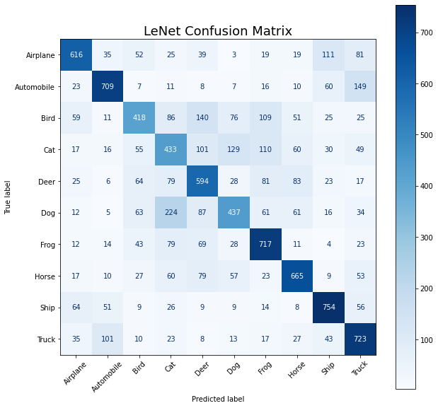
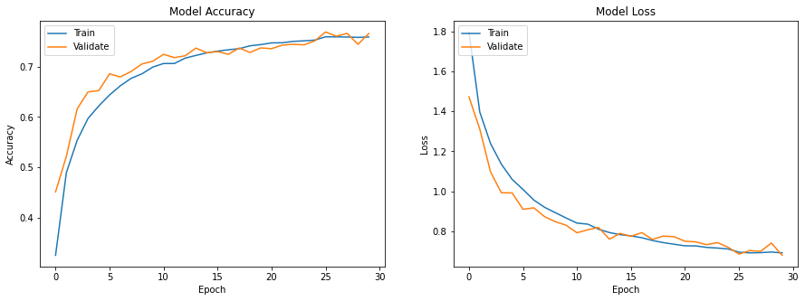
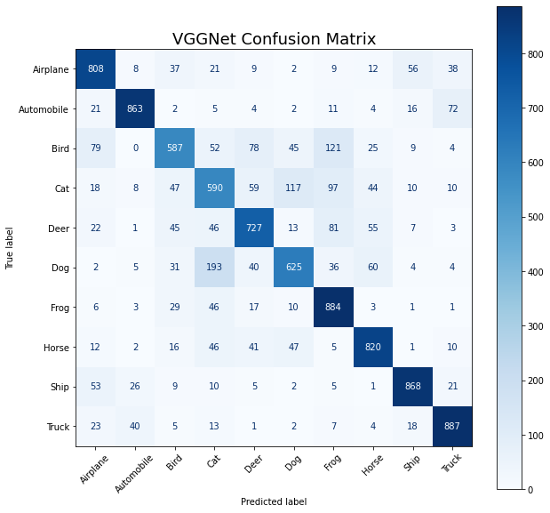
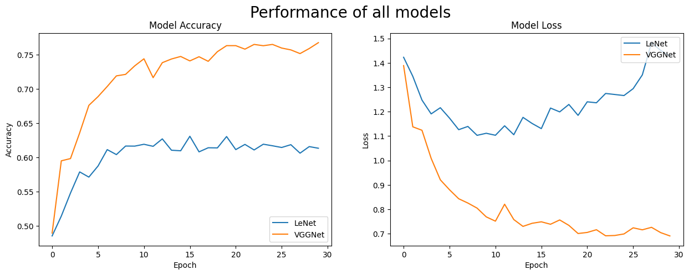

# Image Classification with Convolutional Neural Networks (CNN)
## Table of Contents

- [Overview](#overview)
- [Project Description](#project-description)
  - [LeNet Model](#lenet-model)
  - [VGGNet Model](#vggnet-model)
- [Dataset](#dataset)
  - [Classes](#classes)
  - [Image size](#image-size)
  - [Samples](#samples)
- [Data preprocessing](#data-preprocessing)
  - [Convert to float32](#convert-to-float32)
  - [Normalise (divide by 255)](#normalisedivide-by-255)
  - [One-hot encoding of labels](#one-hot-encoding-of-labels)
- [Classification Techniques](#classification-techniques)
  - [LeNet](#lenet)
    - [Layers](#layers)
    - [Training parameters](#training-parameters)
    - [Performance](#performance)
  - [VGGNet](#vggnet)
    - [Layers](#layers-1)
    - [Training parameters](#training-parameters-1)
    - [Performance](#performance-1)
- [Comparison](#comparison)
## Overview
Image classification is a critical task in computer vision applications, enabling machines to recognise and categorise images accurately. Over the years, there has been a remarkable evolution in image classification algorithms, transitioning from traditional feature-based methods to more advanced deep learning-based techniques. Among these, Convolutional Neural Networks (CNNs) have emerged as a standout success story, significantly improving classification accuracy.
### Project Description
This project, undertaken as part of the 3rd year of the Bachelor's degree program at SGSITS, Indore, involves implementing two popular CNN models, LeNet and VGGNet, and comparing their performance in image classification. The primary goal is to achieve high accuracy in classifying images using deep learning techniques.
#### LeNet Model
The LeNet model, pioneered by Yann LeCun, is an early and influential CNN architecture. It consists of convolutional layers with subsampling, leading to a compact yet effective model. 
#### VGGNet Model
VGGNet, developed by the Visual Graphics Group at Oxford, is known for its simplicity and depth. The model comprises stacked convolutional layers with small receptive fields, followed by max-pooling layers.
## Dataset
[ciFAIR](https://cvjena.github.io/cifair/) 

[Download](https://github.com/cvjena/cifair/releases/download/v1.0/ciFAIR-10.zip)

We use ciFAIR-10, a cleaned version of CIFAR-10 with a duplicate-free test set.

### Classes:
| airplane | automobile | bird | cat | deer |
|----------|------------|------|-----|------|
| dog      | frog       | horse| ship| truck|
### Image size:
```32 x 32 x 3```
### Samples
| Dataset | Samples |
|---------|---------|
| Train   | 50000   |
| Test    | 10000   |
## Data preprocessing
### Convert to float32
```
# Convert data type to float for computation
x_train = x_train.astype('float32')
x_test = x_test.astype('float32')
```
### Normalise(divide by 255)
```
# Normalise the data
x_train /= 255
x_test /= 255
```
### One-hot encoding of labels
```
# Convert class vectors to binary class matrices (One hot encoding)
num_classes = 10
y_train = keras.utils.to_categorical(y_train, num_classes)
y_test = keras.utils.to_categorical(y_test, num_classes)
```
## Classification Techniques
### LeNET
#### Layers
```
[Input]
   ↓
[Conv2D 6 (5×5)]
   ↓
[MaxPooling]
   ↓
[Conv2D 16 (5×5)]
   ↓
[MaxPooling]
   ↓
[Flatten]
   ↓
[Dense 120]
   ↓
[Dense 84]
   ↓
[Dense 1]
   ↓
[Output]
```
#### Training parameters
| Parameter | Value |
|----------|--------|
| Batch size | 64 |
| Epochs | 30 |
| Optimizer | Adam |
| Loss | categorical_crossentropy |
#### Performance
##### Plotting Curves

##### Confusion Matrix

##### Classification report
```
              precision    recall  f1-score   support

           0       0.62      0.72      0.67      1000
           1       0.70      0.70      0.70      1000
           2       0.54      0.51      0.52      1000
           3       0.44      0.40      0.42      1000
           4       0.61      0.49      0.54      1000
           5       0.48      0.56      0.52      1000
           6       0.73      0.63      0.67      1000
           7       0.64      0.70      0.67      1000
           8       0.71      0.73      0.72      1000
           9       0.67      0.69      0.68      1000

    accuracy                           0.61     10000
   macro avg       0.61      0.61      0.61     10000
weighted avg       0.61      0.61      0.61     10000
```
### VGGNet
#### Layers
```
[Input]
   ↓
[Block1: Conv32 → Conv32 → MaxPool → Dropout]
   ↓
[Block2: Conv64 → Conv64 → MaxPool → Dropout]
   ↓
[Block3: Conv128 → Conv128 → MaxPool → Dropout]
   ↓
[Flatten]
   ↓
[Dense 4096]
   ↓
[Dense 4096]
   ↓
[Dense 10]
   ↓
[Softmax]
   ↓
[Output]
```
#### Training parameters
| Parameter | Value |
|----------|--------|
| Batch size | 64 |
| Epochs | 30 |
| Optimizer | Adam |
| Loss | categorical_crossentropy |
#### Performance
##### Plotting Curves

##### Confusion Matrix

##### Classification report
```
              precision    recall  f1-score   support

           0       0.80      0.79      0.80      1000
           1       0.90      0.88      0.89      1000
           2       0.61      0.73      0.67      1000
           3       0.57      0.59      0.58      1000
           4       0.79      0.67      0.72      1000
           5       0.77      0.62      0.68      1000
           6       0.71      0.87      0.78      1000
           7       0.88      0.78      0.83      1000
           8       0.86      0.87      0.87      1000
           9       0.85      0.89      0.87      1000

    accuracy                           0.77     10000
   macro avg       0.77      0.77      0.77     10000
weighted avg       0.77      0.77      0.77     10000
```
## Comparison

### Final Accuracy
| Model | Accuracy |
|--------|----------|
| LeNet | 61% |
| VGGNet | 77% |
