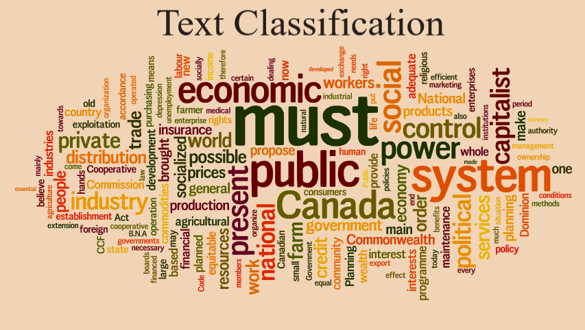
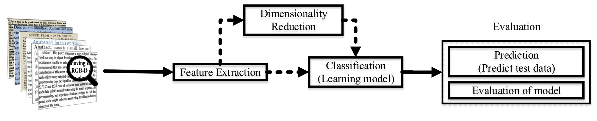
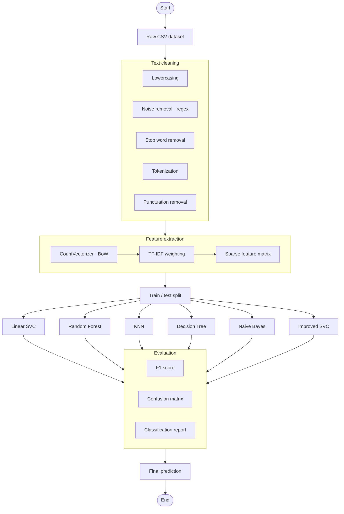
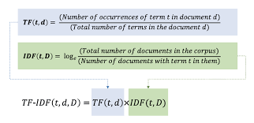
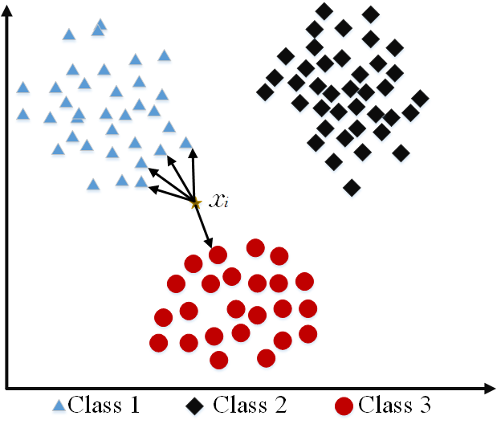
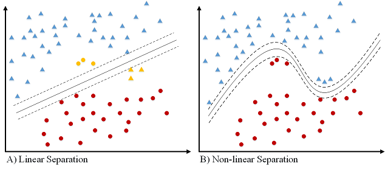
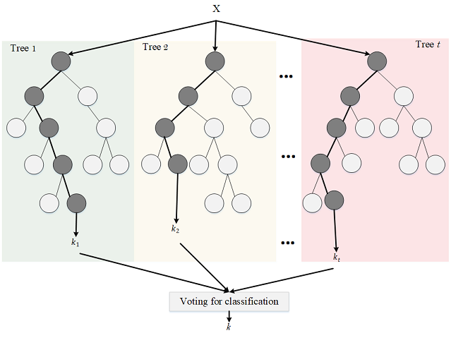
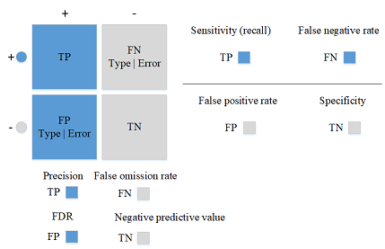

# Text Classification Algorithms


Referenced paper: [Text Classification Algorithms: A Survey](https://arxiv.org/abs/1904.08067)

## Table of Contents

- [Introduction](#introduction)
- [Architecture](#architecture)
- [Text and Document Feature Extraction](#text-and-document-feature-extraction)
  - [Text Cleaning and Pre-processing](#text-cleaning-and-pre-processing)
    - [Tokenization](#tokenization)
    - [Stop Words](#stop-words)
    - [Capitalization](#capitalization)
    - [Noise Removal](#noise-removal)
  - [Weighted Words](#weighted-words)
    - [Term Frequency](#term-frequency)
    - [Term Frequency-Inverse Document Frequency](#term-frequency-inverse-document-frequency)
- [Text Classification Techniques](#text-classification-techniques)
  - [Naive Bayes Classifier](#naive-bayes-classifier)
  - [K-nearest Neighbor](#k-nearest-neighbor)
  - [Support Vector Machine (SVM)](#support-vector-machine-svm)
  - [Decision Tree](#decision-tree)
  - [Random Forest](#random-forest)
  - [Comparison of Text Classification Algorithms](#comparison-of-text-classification-algorithms)
- [Evaluation](#evaluation)
  - [Confusion Matrix](#confusion-matrix)
  - [F1 Score](#f1-score)
- [Dataset](#dataset)
  - [IMDB](#imdb)
- [Text Classification Applications](#text-classification-applications)
  - [Information Retrieval](#information-retrieval)
  - [Information Filtering](#information-filtering)
  - [Sentiment Analysis](#sentiment-analysis)
  - [Recommender Systems](#recommender-systems)
  - [Knowledge Management](#knowledge-management)
  - [Document Summarization](#document-summarization)
- [Text Classification Support](#text-classification-support)
  - [Health](#health)
  - [Social Sciences](#social-sciences)
  - [Business and Marketing](#business-and-marketing)
  - [Law](#law)
    
## Introduction


## Architecture

## Text and Document Feature Extraction

Text feature extraction and pre-processing for classification algorithms are very significant. In this section, we begin discussing text cleaning, since most documents contain a lot of noise. In this part, we discuss two primary methods of text feature extractions — word embedding and weighted word.
### Text Cleaning and Pre-processing
In Natural Language Processing (NLP), most text and documents contain many words that are redundant for text classification, such as stopwords, misspellings, slang, etc. In this section, we briefly explain some techniques and methods for text cleaning and pre-processing text documents. In many algorithms like statistical and probabilistic learning methods, noise and unnecessary features can negatively affect the overall performance. So, elimination of these features are extremely important.
#### Tokenization
Tokenization is the process of breaking down a stream of text into words, phrases, symbols, or any other meaningful elements called tokens. The main goal of this step is to extract individual words in a sentence. Along with text classification, in text mining, it is necessary to incorporate a parser in the pipeline which performs the tokenization of the documents; for example:

Sentence:
```
After sleeping for four hours, he decided to sleep for another four
```

Tokens:
```
{'After', 'sleeping', 'for', 'four', 'hours', 'he', 'decided', 'to', 'sleep', 'for', 'another', 'four'}
```

Python code for Tokenization:
```python
from nltk.tokenize import word_tokenize
text = "After sleeping for four hours, he decided to sleep for another four"
tokens = word_tokenize(text)
print(tokens)
```
#### Stop Words
Text and document classification over social media, such as Twitter, Facebook, and so on is usually affected by the noisy nature (abbreviations, irregular forms) of the text corpuses.

Example from [GeeksForGeeks](https://www.geeksforgeeks.org/removing-stop-words-nltk-python/):

```python
from nltk.corpus import stopwords
from nltk.tokenize import word_tokenize

example_sent = "This is a sample sentence, showing off the stop words filtration."

stop_words = set(stopwords.words('english'))
word_tokens = word_tokenize(example_sent)
filtered_sentence = [w for w in word_tokens if not w in stop_words]

filtered_sentence = []
for w in word_tokens:
    if w not in stop_words:
        filtered_sentence.append(w)

print(word_tokens)
print(filtered_sentence)
```

Output:
```
['This', 'is', 'a', 'sample', 'sentence', ',', 'showing',
'off', 'the', 'stop', 'words', 'filtration', '.']
['This', 'sample', 'sentence', ',', 'showing', 'stop',
'words', 'filtration', '.']
```
#### Capitalization
Sentences can contain a mixture of uppercase and lower case letters. Multiple sentences make up a text document. To reduce the problem space, the most common approach is to reduce everything to lower case. This brings all words in a document in same space, but it often changes the meaning of some words, such as "US" to "us" where first one represents the United States of America and second one is a pronoun. To solve this, slang and abbreviation converters can be applied.
 
```python
text = "The United States of America (USA) or America, is a federal republic composed of 50 states"
print(text)
print(text.lower())
```
 
Output:
```
"The United States of America (USA) or America, is a federal republic composed of 50 states"
"the united states of america (usa) or america, is a federal republic composed of 50 states"
```
#### Noise Removal
Another issue of text cleaning as a pre-processing step is noise removal. Text documents generally contains characters like punctuations or special characters and they are not necessary for text mining or classification purposes. Although punctuation is critical to understand the meaning of the sentence, but it can affect the classification algorithms negatively.

Simple code to remove standard noise from text:

```python
def text_cleaner(text):
    rules = [
        {r'>\s+': u'>'},  # remove spaces after a tag opens or closes
        {r'\s+': u' '},  # replace consecutive spaces
        {r'\s*<br\s*/?>\s*': u'\n'},  # newline after a <br>
        {r'</(div)\s*>\s*': u'\n'},  # newline after </p> and </div> and <h1/>...
        {r'</(p|h\d)\s*>\s*': u'\n\n'},  # newline after </p> and </div> and <h1/>...
        {r'<head>.*<\s*(/head|body)[^>]*>': u''},  # remove <head> to </head>
        {r'<a\s+href="([^"]+)"[^>]*>.*</a>': r'\1'},  # show links instead of texts
        {r'[ \t]*<[^<]*?/?>': u''},  # remove remaining tags
        {r'^\s+': u''}  # remove spaces at the beginning
    ]
    for rule in rules:
        for (k, v) in rule.items():
            regex = re.compile(k)
            text = regex.sub(v, text)
    text = text.rstrip()
    return text.lower()
```
---
### Weighted Words
#### Term Frequency
Term frequency is Bag of Words — one of the simplest techniques of text feature extraction. This method is based on counting number of the words in each document and assign it to feature space.

#### Term Frequency-Inverse Document Frequency
The mathematical representation of weight of a term in a document by Tf-idf is given:



Where N is number of documents and df(t) is the number of documents containing the term t in the corpus. The first part would improve recall and the later would improve the precision of the word embedding. Although tf-idf tries to overcome the problem of common terms in document, it still suffers from some other descriptive limitations. Namely, tf-idf cannot account for the similarity between words in the document since each word is presented as an index. In the recent years, with development of more complex models, such as neural nets, new methods has been presented that can incorporate concepts, such as similarity of words and part of speech tagging. This work uses word2vec and Glove, two of the most common methods that have been successfully used for deep learning techniques.

```python
from sklearn.feature_extraction.text import TfidfVectorizer

def loadData(X_train, X_test, MAX_NB_WORDS=75000):
    vectorizer_x = TfidfVectorizer(max_features=MAX_NB_WORDS)
    X_train = vectorizer_x.fit_transform(X_train).toarray()
    X_test = vectorizer_x.transform(X_test).toarray()
    print("tf-idf with", str(np.array(X_train).shape[1]), "features")
    return (X_train, X_test)
```
## Text Classification Techniques
### Naive Bayes Classifier

Naïve Bayes text classification has been used in industry and academia for a long time (introduced by Thomas Bayes between 1701–1761). However, this technique is being studied since the 1950s for text and document categorization. Naive Bayes Classifier (NBC) is generative model which is widely used in Information Retrieval. Many researchers addressed and developed this technique for their applications. We start with the most basic version of NBC which developed by using term-frequency (Bag of Words) feature extraction technique by counting number of words in documents.

```python
from sklearn.naive_bayes import MultinomialNB
from sklearn.pipeline import Pipeline
from sklearn import metrics
from sklearn.feature_extraction.text import CountVectorizer
from sklearn.feature_extraction.text import TfidfTransformer
from sklearn.datasets import fetch_20newsgroups

newsgroups_train = fetch_20newsgroups(subset='train')
newsgroups_test = fetch_20newsgroups(subset='test')
X_train = newsgroups_train.data
X_test = newsgroups_test.data
y_train = newsgroups_train.target
y_test = newsgroups_test.target

text_clf = Pipeline([('vect', CountVectorizer()),
                     ('tfidf', TfidfTransformer()),
                     ('clf', MultinomialNB()),
                     ])

text_clf.fit(X_train, y_train)
predicted = text_clf.predict(X_test)
print(metrics.classification_report(y_test, predicted))
```

Output:
```
Multinomial Naive Bayes Classification Report
              precision    recall  f1-score   support

           0       0.81      0.88      0.84     12500
           1       0.87      0.79      0.83     12500

    accuracy                           0.84     25000
   macro avg       0.84      0.84      0.84     25000
weighted avg       0.84      0.84      0.84     25000

Multinomial Naive Bayes Confusion Matrix
[[11018  1482]
 [ 2612  9888]]
```

### K-nearest Neighbor
In machine learning, the k-nearest neighbors algorithm (kNN) is a non-parametric technique used for classification. This method is used in Natural-language processing (NLP) as a text classification technique in many researches in the past decades.



```python
from sklearn.neighbors import KNeighborsClassifier
from sklearn.pipeline import Pipeline
from sklearn import metrics
from sklearn.feature_extraction.text import CountVectorizer
from sklearn.feature_extraction.text import TfidfTransformer
from sklearn.datasets import fetch_20newsgroups

newsgroups_train = fetch_20newsgroups(subset='train')
newsgroups_test = fetch_20newsgroups(subset='test')
X_train = newsgroups_train.data
X_test = newsgroups_test.data
y_train = newsgroups_train.target
y_test = newsgroups_test.target

text_clf = Pipeline([('vect', CountVectorizer()),
                     ('tfidf', TfidfTransformer()),
                     ('clf', KNeighborsClassifier()),
                     ])

text_clf.fit(X_train, y_train)
predicted = text_clf.predict(X_test)
print(metrics.classification_report(y_test, predicted))
```

Output:
```
KNN Classification Report
              precision    recall  f1-score   support

           0       0.65      0.67      0.66     12500
           1       0.66      0.64      0.65     12500

    accuracy                           0.65     25000
   macro avg       0.65      0.65      0.65     25000
weighted avg       0.65      0.65      0.65     25000

KNN Confusion Matrix
[[8374 4126]
 [4558 7942]]
```

### Support Vector Machine (SVM)
The original version of SVM was introduced by Vapnik and Chervonenkis in 1963. The early 1990s, nonlinear version was addressed by BE. Boser et al.. Original version of SVM was designed for binary classification problem, but many researchers have worked on multi-class problem using this authoritative technique.

**Advantages:**
- Effective in high dimensional spaces.
- Still effective in cases where number of dimensions is greater than the number of samples.
- Uses a subset of training points in the decision function (called support vectors), so it is also memory efficient.
- Versatile: different Kernel functions can be specified for the decision function. Common kernels are provided, but it is also possible to specify custom kernels.

**Disadvantages:**
- If the number of features is much greater than the number of samples, avoiding over-fitting via choosing kernel functions and regularization term is crucial.
- SVMs do not directly provide probability estimates; these are calculated using an expensive five-fold cross-validation.



```python
from sklearn.svm import LinearSVC
from sklearn.pipeline import Pipeline
from sklearn import metrics
from sklearn.feature_extraction.text import CountVectorizer
from sklearn.feature_extraction.text import TfidfTransformer
from sklearn.datasets import fetch_20newsgroups

newsgroups_train = fetch_20newsgroups(subset='train')
newsgroups_test = fetch_20newsgroups(subset='test')
X_train = newsgroups_train.data
X_test = newsgroups_test.data
y_train = newsgroups_train.target
y_test = newsgroups_test.target

text_clf = Pipeline([('vect', CountVectorizer()),
                     ('tfidf', TfidfTransformer()),
                     ('clf', LinearSVC()),
                     ])

text_clf.fit(X_train, y_train)
predicted = text_clf.predict(X_test)
print(metrics.classification_report(y_test, predicted))
```

Output:
```
Linear SVC Classification Report
              precision    recall  f1-score   support

           0       0.86      0.88      0.87     12500
           1       0.88      0.86      0.87     12500

    accuracy                           0.87     25000
   macro avg       0.87      0.87      0.87     25000
weighted avg       0.87      0.87      0.87     25000

Linear SVC Confusion Matrix
[[11055  1445]
 [ 1745 10755]]
```

### Decision Tree
One of earlier classification algorithm for text and data mining is decision tree. Decision tree classifiers (DTC's) are used successfully in many diverse areas of classification. The structure of this technique includes a hierarchical decomposition of the data space (only train dataset). Decision tree as classification task was introduced by [D. Morgan](http://www.aclweb.org/anthology/P95-1037) and developed by [JR. Quinlan](https://courses.cs.ut.ee/2009/bayesian-networks/extras/quinlan1986.pdf). The main idea is creating trees based on the attributes of the data points, but the challenge is determining which attribute should be in parent level and which one should be in child level. To solve this problem, [De Mantaras](https://link.springer.com/article/10.1023/A:1022694001379) introduced statistical modeling for feature selection in tree.

```python
from sklearn import tree
from sklearn.pipeline import Pipeline
from sklearn import metrics
from sklearn.feature_extraction.text import CountVectorizer
from sklearn.feature_extraction.text import TfidfTransformer
from sklearn.datasets import fetch_20newsgroups

newsgroups_train = fetch_20newsgroups(subset='train')
newsgroups_test = fetch_20newsgroups(subset='test')
X_train = newsgroups_train.data
X_test = newsgroups_test.data
y_train = newsgroups_train.target
y_test = newsgroups_test.target

text_clf = Pipeline([('vect', CountVectorizer()),
                     ('tfidf', TfidfTransformer()),
                     ('clf', tree.DecisionTreeClassifier()),
                     ])

text_clf.fit(X_train, y_train)
predicted = text_clf.predict(X_test)
print(metrics.classification_report(y_test, predicted))
```

Output:
```
Decision Tree Classification Report
              precision    recall  f1-score   support

           0       0.71      0.72      0.72     12500
           1       0.72      0.71      0.71     12500

    accuracy                           0.71     25000
   macro avg       0.71      0.71      0.71     25000
weighted avg       0.71      0.71      0.71     25000

Decision Tree Confusion Matrix
[[9013 3487]
 [3674 8826]]
```

### Random Forest
Random forests or random decision forests technique is an ensemble learning method for text classification. This method was introduced by [T. Kam Ho](https://doi.org/10.1109/ICDAR.1995.598994) in 1995 for first time which used t trees in parallel. This technique was later developed by [L. Breiman](https://link.springer.com/article/10.1023/A:1010933404324) in 1999 that they found converged for RF as a margin measure.



```python
from sklearn.ensemble import RandomForestClassifier
from sklearn.pipeline import Pipeline
from sklearn import metrics
from sklearn.feature_extraction.text import CountVectorizer
from sklearn.feature_extraction.text import TfidfTransformer
from sklearn.datasets import fetch_20newsgroups

newsgroups_train = fetch_20newsgroups(subset='train')
newsgroups_test = fetch_20newsgroups(subset='test')
X_train = newsgroups_train.data
X_test = newsgroups_test.data
y_train = newsgroups_train.target
y_test = newsgroups_test.target

text_clf = Pipeline([('vect', CountVectorizer()),
                     ('tfidf', TfidfTransformer()),
                     ('clf', RandomForestClassifier(n_estimators=100)),
                     ])

text_clf.fit(X_train, y_train)
predicted = text_clf.predict(X_test)
print(metrics.classification_report(y_test, predicted))
```

Output:
```
Random Forest Classification Report
              precision    recall  f1-score   support

           0       0.84      0.86      0.85     12500
           1       0.86      0.84      0.85     12500

    accuracy                           0.85     25000
   macro avg       0.85      0.85      0.85     25000
weighted avg       0.85      0.85      0.85     25000

Random Forest Confusion Matrix
[[10723  1777]
 [ 2012 10488]]
```

### Comparison of Text Classification Algorithms
| Model                            | Advantages                                                                                                   | Disadvantages                                                                                                                                |
| -------------------------------- | ------------------------------------------------------------------------------------------------------------ | -------------------------------------------------------------------------------------------------------------------------------------------- |
| **Naive Bayes Classifier**       | Works well with text data; Easy to implement; Fast                                                           | Strong assumption about data distribution; Limited by data scarcity                                                                          |
| **K-Nearest Neighbor**           | Effective for text; Non-parametric; Considers local text characteristics; Handles multi-class naturally      | Computationally expensive; Difficult to find optimal k; Large search problem; Difficult to find meaningful distance function for text        |
| **Support Vector Machine (SVM)** | Can model non-linear decision boundaries; Robust against overfitting (especially for text)                   | Lack of transparency with high dimensions; Difficult to choose kernel function; Memory complexity                                            |
| **Decision Tree**                | Handles categorical features; Works well with parallel decision boundaries; Fast for learning and prediction | Issues with diagonal decision boundaries; Easily overfit; Extremely sensitive to small perturbations; Problems with out-of-sample prediction |
| **Random Forest**                | Very fast to train; Reduced variance relative to regular trees; No data preparation required                 | Slow to create predictions; More trees increase time complexity; Less interpretable; Prone to overfitting; Must choose number of trees       |

## Evaluation
### Confusion Matrix
A Confusion Matrix is a table used to evaluate the performance of a classification model. It summarizes the correct and incorrect predictions broken down by each class.

| | **Predicted Positive** | **Predicted Negative** |
|---|---|---|
| **Actual Positive** | True Positive (TP) | False Negative (FN) |
| **Actual Negative** | False Positive (FP) | True Negative (TN) |

- True Positive (TP): Correctly predicted positive class
- True Negative (TN): Correctly predicted negative class
- False Positive (FP): Incorrectly predicted as positive (Type I error)
- False Negative (FN): Incorrectly predicted as negative (Type II error
### F1 Score
The F1 Score is the harmonic mean of Precision and Recall, providing a single metric that balances both. It is especially useful when the class distribution is uneven.



Key metrics:
- Precision: Of all predicted positives, how many were actually positive?
- Recall: Of all actual positives, how many were correctly predicted?
- F1 Score: Harmonic mean of Precision and Recall

| Metric | Formula |
|---|---|
| **Precision** | TP / (TP + FP) |
| **Recall** | TP / (TP + FN) |
| **F1 Score** | 2 × (Precision × Recall) / (Precision + Recall) |
## Dataset
### IMDB

- [IMDB Dataset](http://ai.stanford.edu/~amaas/data/sentiment/)
- [Download Link](https://ai.stanford.edu/~amaas/data/sentiment/aclImdb_v1.tar.gz)

This is a dataset for binary sentiment classification containing substantially more data than previous benchmark datasets. It provides a set of 25,000 highly polar movie reviews for training, and 25,000 for testing. There is additional unlabeled data for use as well. Raw text and already processed bag of words formats are provided. Dataset of 25,000 movies reviews from IMDB, labeled by sentiment (positive/negative). Reviews have been preprocessed, and each review is encoded as a sequence of word indexes (integers). For convenience, words are indexed by overall frequency in the dataset, so that for instance the integer "3" encodes the 3rd most frequent word in the data.

As a convention, "0" does not stand for a specific word, but instead is used to encode any unknown word.

```python
from keras.datasets import imdb

(x_train, y_train), (x_test, y_test) = imdb.load_data(path="imdb.npz",
                                                       num_words=None,
                                                       skip_top=0,
                                                       maxlen=None,
                                                       seed=113,
                                                       start_char=1,
                                                       oov_char=2,
                                                       index_from=3)
```

`get_word_index` function:

```python
tf.keras.datasets.imdb.get_word_index(path="imdb_word_index.json")
```
## Text Classification Applications
### Information Retrieval
Information retrieval is finding documents of an unstructured data that meet an information need from within large collections of documents. With the rapid growth of online information, particularly in text format, text classification has become a significant technique for managing this type of data. Some of the important methods used in this area are Naive Bayes, SVM, decision tree, J48, k-NN and IBK.

- 🎓 [Introduction to information retrieval](http://eprints.bimcoordinator.co.uk/35/) — Manning, C., Raghavan, P., & Schütze, H. (2010).
- 🎓 [Web forum retrieval and text analytics: A survey](http://www.nowpublishers.com/article/Details/INR-062) — Hoogeveen, Doris, et al. (2018).
- 🎓 [Automatic Text Classification in Information retrieval: A Survey](https://dl.acm.org/citation.cfm?id=2905191) — Dwivedi, Sanjay K., and Chandrakala Arya. (2016).
### Information Filtering
Information filtering refers to selection of relevant information or rejection of irrelevant information from a stream of incoming data. Information filtering systems are typically used to measure and forecast users' long-term interests. Probabilistic models, such as Bayesian inference network, are commonly used in information filtering systems.

- 🎓 [Search engines: Information retrieval in practice](http://library.mpib-berlin.mpg.de/toc/z2009_2465.pdf/) — Croft, W. B., Metzler, D., & Strohman, T. (2010).
- 🎓 [Implementation of the SMART information retrieval system](https://ecommons.cornell.edu/bitstream/handle/1813/6526/85-686.pdf?sequence=1) — Buckley, Chris.
### Sentiment Analysis
Sentiment analysis is a computational approach toward identifying opinion, sentiment, and subjectivity in text. Sentiment classification methods classify a document associated with an opinion to be positive or negative. Naive Bayesian classification and SVM are some of the most popular supervised learning methods that have been used for sentiment classification.

- 🎓 [Opinion mining and sentiment analysis](http://www.nowpublishers.com/article/Details/INR-011) — Pang, Bo, and Lillian Lee. (2008).
- 🎓 [A survey of opinion mining and sentiment analysis](https://link.springer.com/chapter/10.1007/978-1-4614-3223-4_13) — Liu, Bing, and Lei Zhang. (2010).
- 🎓 [Thumbs up?: sentiment classification using machine learning techniques](https://dl.acm.org/citation.cfm?id=1118704) — Pang, Bo, Lillian Lee, and Shivakumar Vaithyanathan.
### Recommender Systems
Content-based recommender systems suggest items to users based on the description of an item and a profile of the user's interests. A user's profile can be learned from user feedback (history of the search queries or self reports) on items as well as self-explained features (filter or conditions on the queries) in one's profile. Many different types of text classification methods, such as decision trees, nearest neighbor methods, Rocchio's algorithm, linear classifiers, probabilistic methods, and Naive Bayes, have been used to model user's preference.

- 🎓 [Content-based recommender systems](https://link.springer.com/chapter/10.1007/978-3-319-29659-3_4) — Aggarwal, Charu C. (2016).
- 🎓 [Content-based recommendation systems](https://link.springer.com/chapter/10.1007/978-3-540-72079-9_10) — Pazzani, Michael J., and Daniel Billsus.
### Knowledge Management
Textual databases are significant sources of information and knowledge. A large percentage of corporate information (nearly 80%) exists in textual data formats (unstructured). Document categorization is one of the most common methods for mining document-based intermediate forms.

- 🎓 [Text mining: concepts, applications, tools and issues-an overview](http://citeseerx.ist.psu.edu/viewdoc/download?doi=10.1.1.403.2426&rep=rep1&type=pdf) — Sumathy, K. L., and M. Chidambaram. (2013).
### Document Summarization
Text classification used for document summarizing which summary of a document may employ words or phrases which do not appear in the original document. Multi-document summarization also is necessitated due to increasing online information rapidly.

- 🎓 [Advances in automatic text summarization](https://books.google.com/books?hl=en&lr=&id=YtUZQaKDmzEC&oi=fnd&pg=PA215&dq=Advances+in+automatic+text+summarization&ots=ZpvCsrG-dC&sig=8ecTDTrQR4mMzDnKvI58sowh3Fg) — Mani, Inderjeet.
- 🎓 [Improving Multi-Document Summarization via Text Classification](https://www.aaai.org/ocs/index.php/AAAI/AAAI17/paper/viewPaper/14525) — Cao, Ziqiang, et al. (2017).

## Text Classification Support
### Health
Most textual information in the medical domain is presented in an unstructured or narrative form with ambiguous terms and typographical errors. Medical coding, which consists of assigning medical diagnoses to specific class values obtained from a large set of categories, is an area of healthcare applications where text classification techniques can be highly valuable.

- 🎓 [Patient2Vec: A Personalized Interpretable Deep Representation of the Longitudinal Electronic Health Record](https://ieeexplore.ieee.org/abstract/document/8490816/) — Zhang, Jinghe, et al. (2018)
- 🎓 [Combining Bayesian text classification and shrinkage to automate healthcare coding: A data quality analysis](https://dl.acm.org/citation.cfm?id=2063506) — Lauría, Eitel JM, and Alan D. March. (2011).
- 🎓 [MeSH Up: effective MeSH text classification for improved document retrieval](https://academic.oup.com/bioinformatics/article-abstract/25/11/1412/333120) — Trieschnigg, Dolf, et al.
### Social Sciences
Text classification and document categorization has increasingly been applied to understanding human behavior in past decades. Recent data-driven efforts in human behavior research have focused on mining language contained in informal notes and text datasets, including short message service (SMS), clinical notes, social media, etc.

- 🎓 [Identification of imminent suicide risk among young adults using text messages](https://dl.acm.org/citation.cfm?id=3173987) — Nobles, Alicia L., et al. (2018).
- 🎓 [Textual Emotion Classification: An Interoperability Study on Cross-Genre Data Sets](https://link.springer.com/chapter/10.1007/978-3-319-63004-5_21) — Ofoghi, Bahadorreza, and Karin Verspoor. (2017).
- 🎓 [Social Monitoring for Public Health](https://www.morganclaypool.com/doi/abs/10.2200/S00791ED1V01Y201707ICR060) — Paul, Michael J., and Mark Dredze (2017).
### Business and Marketing
Profitable companies and organizations are progressively using social media for marketing purposes. Opinion mining from social media such as Facebook, Twitter, and so on is main target of companies to rapidly increase their profits. Text and document classification is a powerful tool for companies to find their customers easier than ever.

- 🎓 [Opinion mining using ensemble text hidden Markov models for text classification](https://www.sciencedirect.com/science/article/pii/S0957417417304979) — Kang, Mangi, Jaelim Ahn, and Kichun Lee. (2018).
- 🎓 [Classifying business marketing messages on Facebook](https://www.researchgate.net/profile/Bei_Yu2/publication/236246670_Classifying_Business_Marketing_Messages_on_Facebook/links/56bcb34408ae6cc737c6335b.pdf) — Yu, Bei, and Linchi Kwok.
### Law
Huge volumes of legal text information and documents have been generated by governmental institutions. Retrieving this information and automatically classifying it can not only help lawyers but also their clients. In the United States, the law is derived from five sources: constitutional law, statutory law, treaties, administrative regulations, and the common law.

- 🎓 [Represent yourself in court: How to prepare & try a winning case](https://books.google.com/books?hl=en&lr=&id=-lodDQAAQBAJ&oi=fnd&pg=PP1&dq=Represent+yourself+in+court:+How+to+prepare+%5C%26+try+a+winning+case&ots=tgJ8Q2MkH_&sig=9o3ILDn3LfO30BZKsyI2Ou7Q8Qs) — Bergman, Paul, and Sara J. Berman. (2016)
- 🎓 [Text retrieval in the legal world](https://link.springer.com/article/10.1007/BF00877694) — Turtle, Howard.
